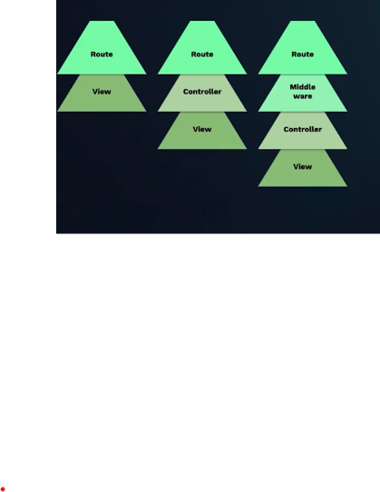

# introducción a Laravel

Desarrollo de sistemas web

Entender a laravel como un sistema de capas

Para trabajar con PHP necesitamos convertir a nuestro equipo en un servidor web, esto se debe a PHP es un lenguaje del lado del servidor a diferencia de Javascript que es del lado del cliente y funciona bien solo con el navegador.

Del lado del servidor significa que consiste en el procesamiento de una petición de usuario en una computadora llamada servidor web, esta petición se procesa y luego genera páginas en HTML con la respuesta deseada.